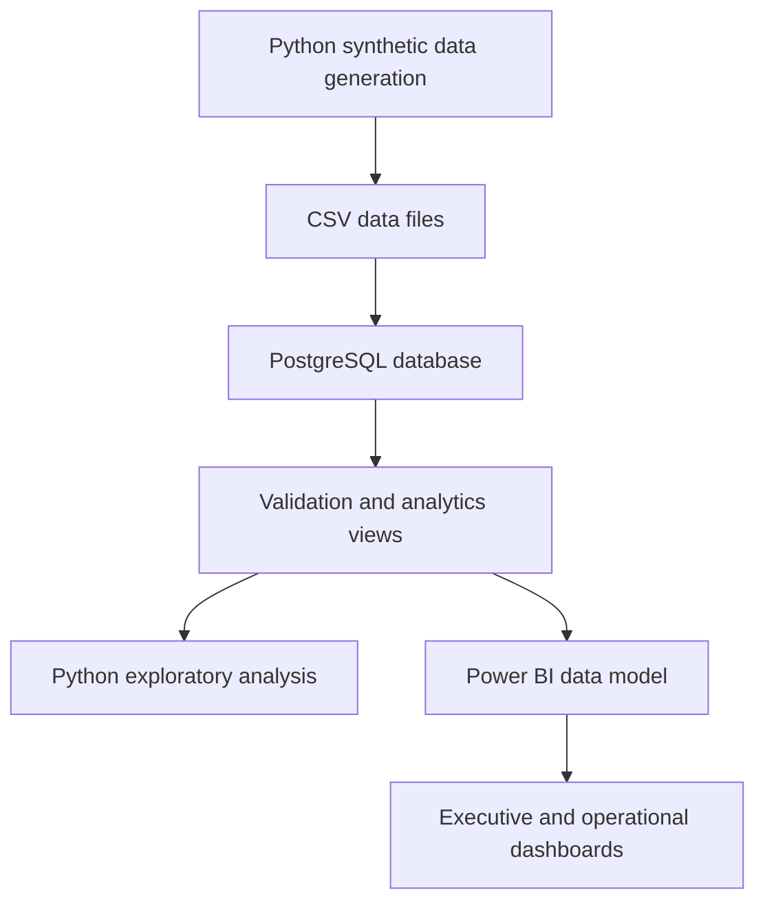

# Telecom Billing and Revenue Assurance Analytics

An end-to-end telecom analytics project that transforms synthetic billing and customer data into validated PostgreSQL analytics views, Python analysis, and an interactive Power BI report.

The project focuses on billing performance, payment collection, outstanding balances, customer risk, and potential revenue leakage.

## Dashboard Preview

### Executive Overview


### Revenue Leakage


### Customer Risk


## Business Objectives

This project was designed to answer the following questions:

- How much revenue has been billed and collected?
- What proportion of billed revenue remains outstanding?
- How does billing and collection performance change over time?
- Which customer segments have the largest outstanding balances?
- Which customers present the highest payment risk?
- Where are base-charge and usage-charge underbilling occurring?
- How much potential revenue leakage has been detected?

## Key Results

| KPI | Result |
|---|---:|
| Total billed | $44.76M |
| Net collected | $37.28M |
| Collection rate | 83.55% |
| Collectible outstanding balance | $6.19M |
| Detected revenue leakage | $275.47K |
| Invoices analysed | 510.60K |
| Leakage cases detected | 15.82K |
| Customers assessed for risk | 24.73K |
| High-risk customers | 8.84K |
| High-risk outstanding balance | $3.99M |
| Overdue invoices | 49.69K |

## Solution Architecture



## Technologies Used

- Python
- Pandas
- SQLAlchemy
- PostgreSQL 18
- SQL
- Jupyter Notebook
- Power BI Desktop
- DAX
- Git and GitHub

## Dataset

The project uses reproducible synthetic telecom data designed to represent realistic customer, subscription, billing, usage, payment, and adjustment activity.

| Dataset | Rows |
|---|---:|
| Customers | 25,000 |
| Plans | 10 |
| Subscriptions | 34,455 |
| Usage records | 510,595 |
| Invoices | 510,595 |
| Payments | 545,321 |
| Adjustments | 28,565 |

The complete transaction layer contains approximately 1.6 million records.

## Analytics Views

Four PostgreSQL views provide the business-ready analytical layer:

| View | Purpose | Rows |
|---|---|---:|
| `vw_invoice_financials` | Consolidated invoice, payment and adjustment results | 510,595 |
| `vw_monthly_kpis` | Monthly billing, collection and outstanding-balance KPIs | 144 |
| `vw_revenue_leakage` | Potential base-charge and usage-charge underbilling | 15,822 |
| `vw_customer_risk` | Customer-level payment and outstanding-balance risk | 24,731 |

## Power BI Report

The Power BI report contains three interactive pages:

### 1. Executive Overview

- Billing and collection KPIs
- Monthly billing versus collections
- Outstanding balance by customer segment
- Customer risk distribution
- Customer segment and year filters

### 2. Revenue Leakage

- Total estimated leakage
- Number of leakage cases
- Average leakage per case
- Leakage rate
- Leakage by category and customer segment
- Monthly leakage trend
- Detailed leakage records

### 3. Customer Risk

- Customers assessed
- High-risk customers
- High-risk outstanding balance
- Overdue invoices
- Risk distribution
- Outstanding balance by risk level
- Customer risk by segment
- Highest-risk customer details

## Project Structure

```text
Telecom-revenue-analytics/
├── data/
├── documentation/
├── images/
│   ├── Executive Overview.png
│   ├── Revenue Leakage.png
│   └── Customer Risk.png
├── notebooks/
├── power bi/
│   └── Telecom Revenue Analytics.pbix
├── scripts/
├── sql/
├── .gitignore
├── README.md
└── requirements.txt
```

## Running the Project

1. Clone the repository.

```bash
git clone https://github.com/NaveenSukhavasi/Telecom-revenue-analytics.git
cd Telecom-revenue-analytics
```

2. Create and activate a Python virtual environment.

```powershell
python -m venv .venv
.\.venv\Scripts\Activate.ps1
pip install -r requirements.txt
```

3. Create the PostgreSQL database and configure the database connection.

4. Run the Python data-generation and loading scripts.

5. Execute the SQL files in numerical order to create, validate and prepare the analytics layer.

6. Run the exploratory-analysis notebook.

7. Open the Power BI report:

[Download the Power BI report](power%20bi/Telecom%20Revenue%20Analytics.pbix)

## Data Validation

The solution includes validation checks covering:

- Master-table and transaction-table row counts
- Foreign-key integrity
- Billing, payment and adjustment control totals
- Outstanding-balance reconciliation
- Base-charge underbilling
- Usage-charge underbilling
- Analytics-view row counts
- Customer-risk classifications

## Limitations

- The data is synthetically generated and does not represent a real telecommunications company.
- Revenue-leakage rules are analytical indicators and would require investigation before being treated as confirmed financial loss.
- Customer-risk categories demonstrate prioritisation logic rather than a predictive machine-learning model.
- PostgreSQL credentials and local connection details are excluded from the repository.

## Future Improvements

- Automate the pipeline using a workflow orchestration tool.
- Add incremental data loading.
- Deploy the database and pipeline to a cloud platform.
- Add automated data-quality testing.
- Develop a predictive model for payment-default risk.
- Publish the dashboard through Power BI Service.

## Author

**Naveen Sukhavasi**

- GitHub: [NaveenSukhavasi](https://github.com/NaveenSukhavasi)